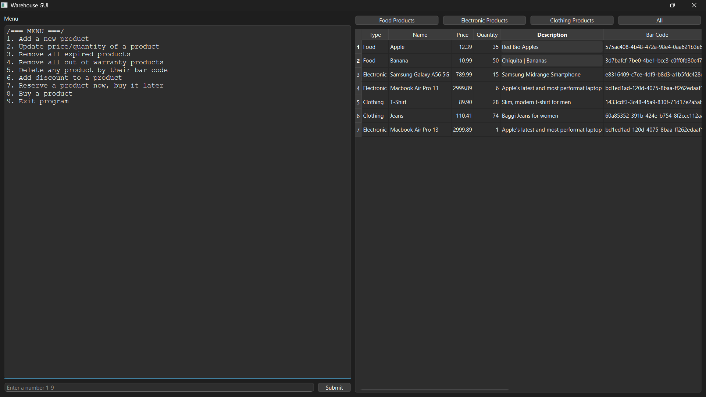
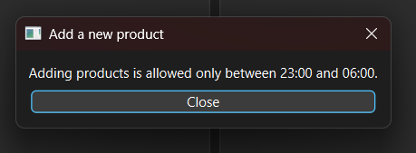
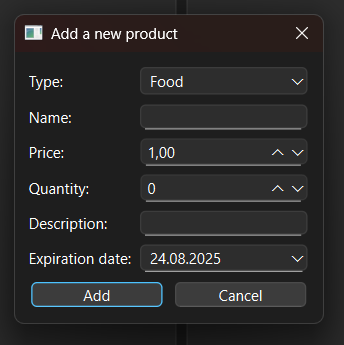
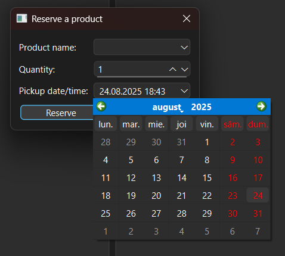
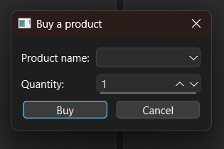

# 🏭 Warehouse Management System (Python)

---

## 📋 Table of Contents
- 🏷️ [Project Description](#project-description)
- 📷 [Screenshots](#screenshots)
- ✨ [Features](#features)
- 🛠️ [Technologies](#technologies)
- 🗂️ [Project Structure](#project-structure)
- ⚙️ [Requirements](#requirements)
- 💾 [Installation](#installation)
- ▶️ [Usage](#usage)
- 🧪 [Running Tests](#running-tests)
- ⚠️ [Notes](#notes)
- 🫱🏻‍🫲🏼 [Contributing](#contributing)
- 📜 [License](#license)
- 👨🏻‍💻 [Author](#author--contact) / 📩 [Contact](#author--contact)
- 💰 [Support Me!](#if-you-want-to-support-me)

---

## Project Description
This project is a **warehouse management system** built in Python, designed to simulate real-world warehouse operations.  
It includes support for multiple product categories, product reservations, purchase logic, warranty/expiration checks, and manager-only operations during restricted hours.  

The system also comes with a simple **graphical interface** (using PyQt6) that mirrors the command-line menu.  
<!-- ## Badges -->
<!-- ## Live Demo -->

---

## Screenshots
<p align="center">
  
  
</p>

<br>

<p align="center">
  
  
  
</p>

---

## Features
- **Product categories:**
  - Food Products (with expiration dates)
  - Electronic Products (with warranty dates)
  - Clothing Products (with size, color, material)

- **Core functionalities:**
  - Add new products
  - Update product details
  - Buy products
  - Reserve products for later pickup
  - Apply discounts
  - Delete products
  - Automatically remove expired or out-of-warranty items

- **Reservation system:**
  - Products can be reserved for a future date & time
  - Expired reservations are automatically cleared
  - Reserved products show separately from warehouse stock

- **Business rules enforced:**
  - Expired food items cannot be purchased or reserved
  - Electronics out of warranty cannot be purchased or reserved
  - Manager-only operations (e.g., adding/removing products, discounts) are allowed only between **23:00–06:00**

- **Graphical UI (PyQt6):**
  - Main window with:
    - Menu (select operations by number + submit button)
    - Category buttons (Food / Electronics / Clothing)
    - Product list displayed per category (warehouse + reservations)
  - Each operation opens a new window for user input
  - Success and error messages shown in dialogs

---

## Technologies
- Python
- PyQt6
- Pickle
- Typing
- Sys
- Datetime
- Uuid
- Functools
- Unittes
---

## Project Structure
- │ 📁 warehouse-management/
- ├── products.py
- ├── warehouse.py
- ├── decorators.py
- ├── main.py
- ├── test_warehouse.py
- ├── test_decorators.py
- ├── screenshots/
- │   └── main-panel.png
- │   └── restriction-message.png
- │   └── add-product-panel.png
- │   └── reserve-product-panel.png
- │   └── buy-product-panel.png
- ├── .gitignore file
- ├── MIT License file
- ├── requirements.txt
- └── README.md

---

## Requirements
- Python 3.9+
- Dependencies listed in [requirements.txt](requirements.txt)

---

## Installation
1. Clone this repository:
```bash
git clone https://github.com/xAndreiix/Warehouse_Manager.git
```
```bash
cd warehouse_management
```
2. (Optional but recommended) Create a virtual environment:
```bash
- python -m venv venv
```
```bash
- source venv/bin/activate   # On Linux/Mac
```
```bash
- venv\Scripts\activate      # On Windows
```
3. Install dependencies:
```bash
- pip install -r requirements.txt
```
---

## Usage
Run the program:
```bash
python main.py
```
- The main window will show the warehouse menu and product categories.
- Choose an option by entering its number and pressing Submit.
- Or click a category button (Food / Electronics / Clothing) to view available products.
- When performing actions (buying, reserving, adding, etc.), a new input window will open.
- Messages will guide you if the action succeeds or fails.

- Start program → main window opens with menu.
- Click Food Products → see all food items (with expiration dates).
- Choose menu option 3 (Buy Product) → input name + quantity → success message shows.
- Try to reserve an expired product → system blocks with warning.
- Manager logs in at 23:30 → can add new stock and apply discounts.
<!-- ## Configuration -->

---

## Running Tests
```bash
- python -m unittest test_warehouse.py
```
```bash
- python -m unittest test_decorators.py
```
<!-- ## Deployment -->

---

## Notes
- Manager-only actions (add_product, update_products, remove_expired_products, remove_out_of_warranty_products, delete_products, add_discount) are restricted to 23:00–06:00.
- Customers can buy or reserve anytime, but outside business hours the action is logged for the next business day.
<!-- ## Road Map -->
<!-- ## FAQ -->

---

## Contributing
Pull requests are welcome.
For major changes, please open an issue first to discuss what you’d like to change.
<!-- ## Changelog -->

---

## License
This project is licensed under the MIT License - see the [LICENSE](LICENSE)

---

## Author / Contact
**Author:** 
Andrei Iliescu

[](https://xandreiix.github.io/Andrei-Iliescu-Portfolio/)

**Contact:**  

[](https://linkedin.com/in/andrei-iliescu-aa7910214)<br>
[](mailto:andrey_iliescu@yahoo.com)<br>
[](mailto:andrei.iliescu13102000@gmail.com)

---

## If you want to support me
[](https://paypal.me/xAndreiix)<br>
[](https://revolut.me/xandreiix)
